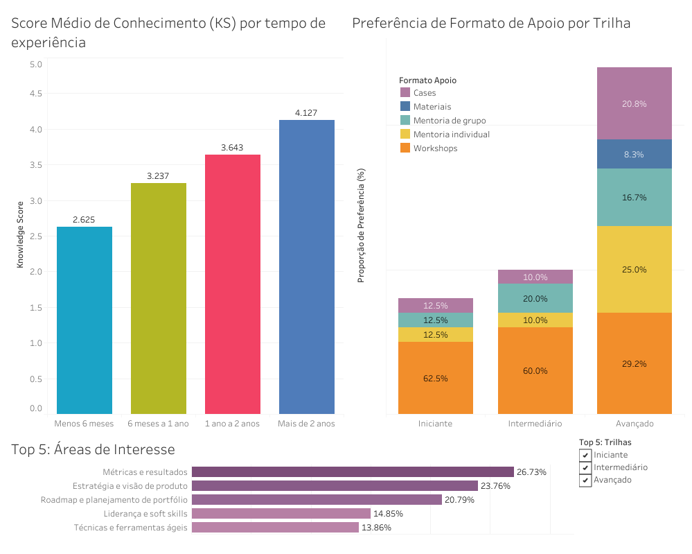
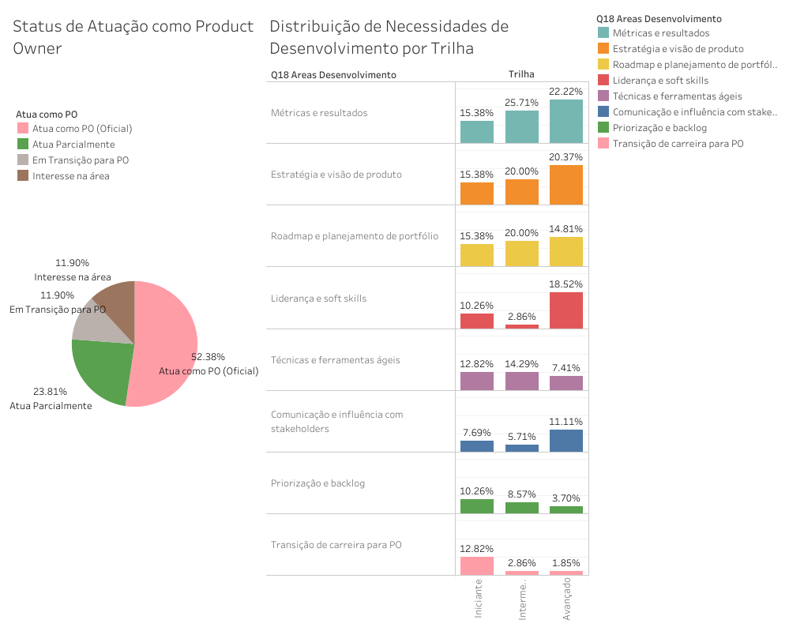
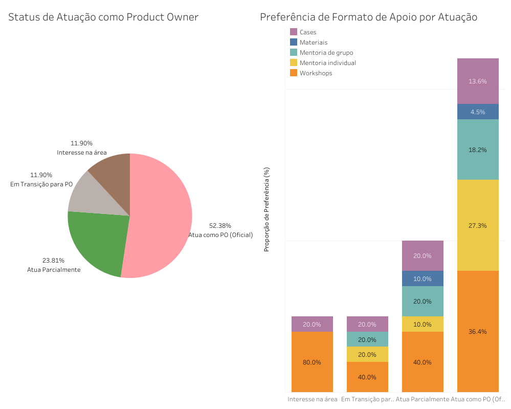

# 📊 Análise Diagnóstica da Jornada de Product Owners (PO)

| 🔗 Links do Projeto | |
| :--- | :--- |
| **Dashboard Interativo** |  |
| **Relatório Técnico** |  |

**Por: Shaini Dittberner** *Data do Diagnóstico: 11/10/2025*

---

## 💡 Destaques do Conhecimento
> 💡 **Score de Conhecimento:** O `knowledge_score` médio exato do grupo com `tempo_experiencia` de **'mais_2a'** é **4.127407**.
>
> 💡 **Foco Iniciante:** A trilha de profissionais iniciantes demonstrou um foco de desenvolvimento triplo: **Estratégia e visão de produto (6)**, **Métricas e resultados (6)** e **Roadmap e planejamento de portfólio (6)**.

---

## A) Insights do Diagnóstico 💡
* **76% do público** já atua como PO (oficial ou parcial).
* **Perfis de Mentoria:** Dois perfis específicos buscam Mentoria Individual: PO oficial + transição de carreira.
* **Base Intermediária:** 60% dos interessados (que não atuam como PO) possuem conhecimento intermediário.
* **Workshops:** Aparecem em proporção significativa em todas as etapas da jornada.
* **Senioridade:** POs avançados demonstram procura diferenciada por **liderança e soft skills**.

---

## B) Recomendações para o Programa de Desenvolvimento
### 1. Onde Focar
* **Público Consolidado:** Priorizar aprimoramento de POs atuantes, com foco em performance, influência e visão estratégica.
* **Transição de Carreira:** Manter menor foco aqui, voltado a quem já tem base intermediária e busca aplicação prática.

### 2. Formatos de Apoio por Etapa
| Etapa da Jornada | Objetivo do Mentor | Formatos Recomendados | Estilo de Mentoria |
| :--- | :--- | :--- | :--- |
| **1. Interesse** | Inspirar e introduzir fundamentos | 🟨 Workshops (80%) 🟪 Cases (20%) | Instrucional e motivacional |
| **2. Em Transição** | Conectar teoria à prática | 🟨 Workshops (40%) 🟥 Indiv. (20%) 🟦 Grupo (20%) | Facilitador de aprendizagem |
| **3. Atua Parcial** | Fortalecer autonomia | 🟨 Workshops (40%) 🟦 Grupo (20%) 🟪 Cases (20%) | Curador e mediador |
| **4. PO Oficial** | Visão estratégica e impacto | 🟨 Workshops (36%) 🟥 Indiv. (27%) 🟦 Grupo (18%) | Coach estratégico e parceiro |

### 3. Recomendação de Conteúdo
| Público-Alvo | Foco Principal do Conteúdo | Método Sugerido |
| :--- | :--- | :--- |
| **Avançados / Oficiais** | Métricas + Estratégia + Liderança | Mentoria Individual / Workshops |
| **Intermediários / Parciais** | Roadmap + Comunicação + Técnicas Ágeis | Workshops / Mentoria em Grupo |
| **Iniciantes / Transição** | Transição + Priorização + Técnicas Ágeis | Mentoria para Aceleração |

---

## C) O que os gráficos mostram
📊 **1. Score Médio de Conhecimento (KS) por Experiência** O nível de conhecimento aumenta consistentemente com a experiência, indicando um desenvolvimento natural da maturidade técnica e estratégica.

🧩 **2. Necessidades de Desenvolvimento** As lacunas principais estão em temas estratégicos (Métricas, Estratégia, Roadmap) e Liderança, superando a busca por práticas meramente operacionais.

🧠 **3. Preferência de Formato de Apoio** * **Iniciantes:** 62,5% preferem workshops (formação estruturada).
* **Avançados:** Procura diversificada, com crescimento expressivo em mentoria individual (25%).

🎯 **4. Status de Atuação** 52% Oficial | 24% Parcial | 12% Transição | 12% Interesse.  
*Público diretamente alinhado ao objetivo do mentor.*

---

## 🛠️ Tecnologias e Processos
* **Linguagem R:** Limpeza de dados, tratamento de strings com `regex` e conversão de datas (`lubridate`).
* **Tableau:** Dashboards interativos para exploração visual.
* **Metodologia:** Análise diagnóstica com foco em recomendações de negócio.

---

**Autor:** Shaini Dittberner  
**Data:** 11 de Outubro de 2025
